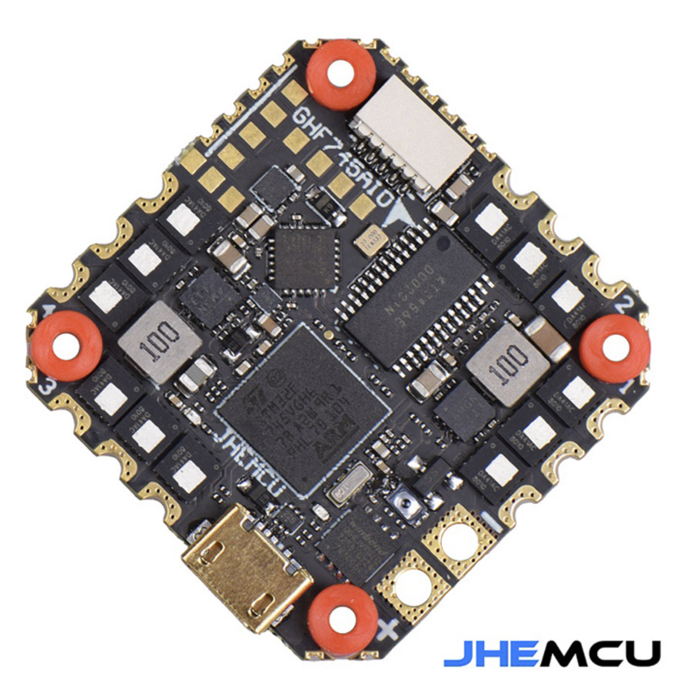

# JHEMCU GHF745AIO AIO Flight Controller

The GHF745AIO is an AIO flight controller produced by JHEMCU.

https://www.jhemcu.com/e_productshow/?65-GHF745AIO-50A-65.html
https://iflyfpv.ro/ro/produs/jhemcu-ghf745aio-hd-mpu6000-50a

## Features

**Flight controller**
 - STM32F745 MCU
 - MPU6000 IMU
 - BMP280 barometer
 - microSD card slot
 - AT7456E OSD
 - 6 UARTs
 - programmable LEDs
 - 8MB black box storage
 - Weight: 7.3g

**ESC**
 - STM32G071 MCU
 - Firmware: Blheli_32
 - Current: 40A/50A
 - Input voltage: 3S-6S（11.5V-26V)

## Pinout

## UART Mapping

The UARTs are marked Rn and Tn in the above pinouts. The Rn pin is the
receive pin for UARTn. The Tn pin is the transmit pin for UARTn.

 - SERIAL0 -> USB
 - SERIAL1 -> UART1 (DMA)
 - SERIAL2 -> UART2 (DMA)
 - SERIAL3 -> UART3 (GPS)
 - SERIAL4 -> UART4
 - SERIAL5 -> UART5
 - SERIAL6 -> UART6 (Camera)

## RC Input
 
RC input is configured on SERIAL2 (USART2).
  
## OSD Support

The GHF745AIO supports OSD using OSD_TYPE 1 (MAX7456 driver).

## Motor Output

The built-in ESC is mapped to motor outputs 1-4. Bidirectional DShot is supported (Dshot150，Dshot300，Dshot600).

## Battery Monitoring

The board has a built-in voltage and current sensors. 

The correct battery setting parameters are:

 - BATT_MONITOR 4
 - BATT_VOLT_PIN 13
 - BATT_VOLT_SCALE 10.1
 - BATT_CURR_PIN 12
 - BATT_CURR_SCALE 17.0

These are set by default in the firmware and shouldn't need to be adjusted

## Compass

The GHF745AIO does not have a builtin compass, but you can attach an external compass to the I2C pins.

## LED

The board includes a LED_STRIP output.

## Loading Firmware

Initial firmware load can be done with DFU by plugging in USB with the bootloader button pressed.

Once the initial firmware is loaded you can update the firmware using any ArduPilot ground station software. Updates should be done with the *.apj firmware files.
